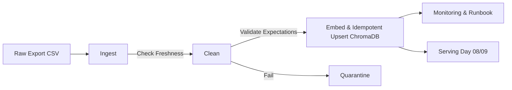

# Kiến trúc pipeline — Lab Day 10

**Nhóm:** C401-D2  
**Cập nhật:** 15/04/2026

---

## 1. Sơ đồ luồng (bắt buộc có 1 diagram: Mermaid / ASCII)

## 2. Ranh giới trách nhiệm

| Thành phần | Input                   | Output                         | Owner nhóm                   |
| ---------- | ----------------------- | ------------------------------ | ---------------------------- |
| Ingest     | policy_export_dirty.csv | raw_records, manifest_baseline | Nguyễn Thành Đạt (Member 1)  |
| Transform  | raw_records             | cleaned_records, quarantine    | Hoàng Ngọc Anh (Member 2)    |
| Quality    | cleaned_records         | validated_records              | Đậu Văn Quyền (Member 3)     |
| Embed      | validated_records       | vector_db (day10_kb)           | Vũ Duy Linh (Member 4)       |
| Monitor    | manifest, logs          | freshness_status, runbook      | Nguyễn Hoàng Việt (Member 5) |

## 3. Idempotency & rerun

- Strategy: Upsert theo `chunk_id` dựa trên cơ sở tài liệu gốc `doc_id`
- Khi rerun, hệ thống sẽ tự động tra cứu ID metadata, thay vì add thêm ngẫu nhiên thì sẽ ghi đè vector mới. Do đó DB Chroma không sinh vector rác, idempotency được bảo đảm.

## 4. Liên hệ Day 09

- Vector store lấy data vào `day10_kb`. Khác với day 09, mục tiêu là đưa Data Observability giúp Agent xử lý dữ liệu chuẩn từ ETL. Các Agent của Day 09 sẽ được cập nhật endpoint qua Collection `day10_kb` này.

## 5. Rủi ro đã biết

- Pipeline hiện tại xử lý offline trên CSV có thể bị trễ so với data DB thực tế.
- Unicode BOM từ raw source thỉnh thoảng gây khó khăn cho việc nhúng nếu Clean Layer cấu hình thiếu sót.
